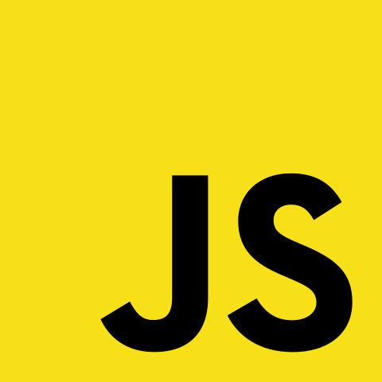
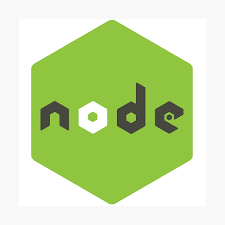
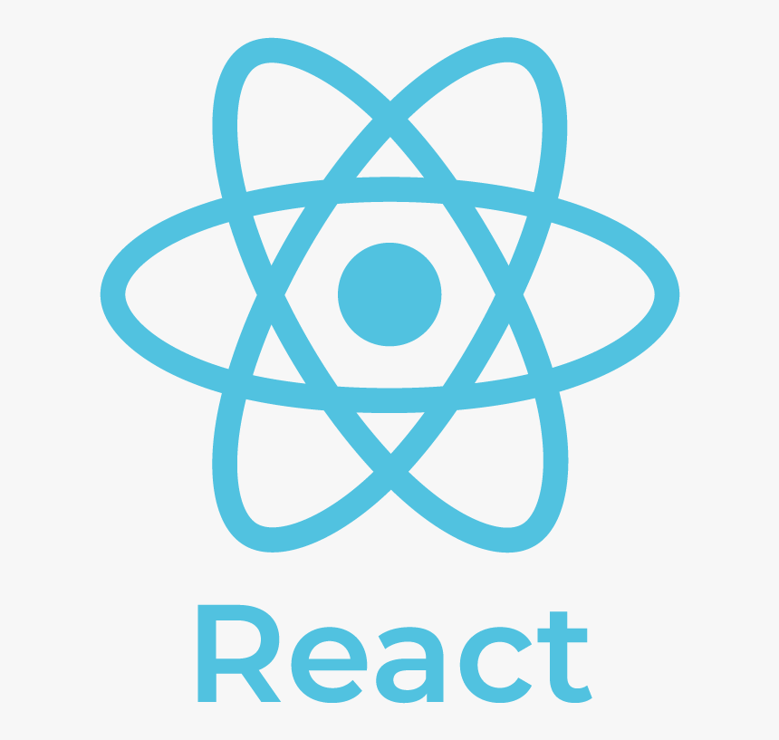
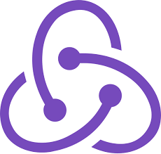
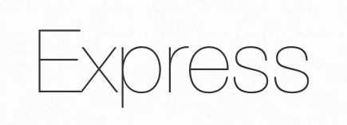
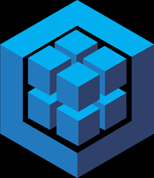
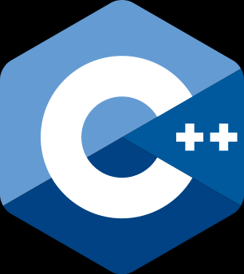
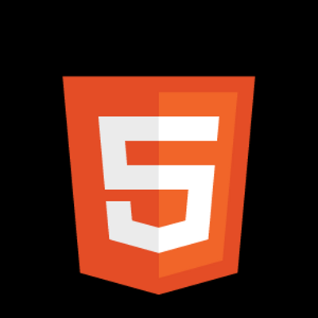
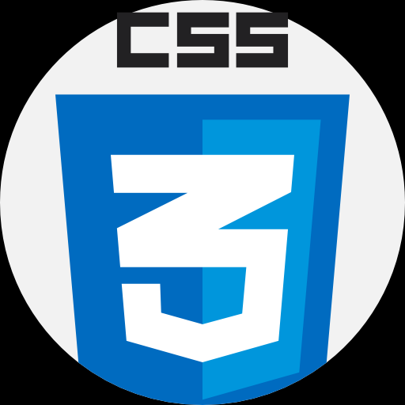

<!-- TODO: css animation -->

# 
Hola, mi nombre es Francisco!

## Sobre Mi

Electronics technician, Full-Stack Developer

Generando experiencias desde el desarrollo

## Skills

 JavaScript 

  NodeJs 

  React 

  Redux 

  Express 

  Sequelize 

  PostgreSQL 

  C++ 

  Python 

  HTML 

  CSS 

## Proyectos

### Chess

### Videogames database

